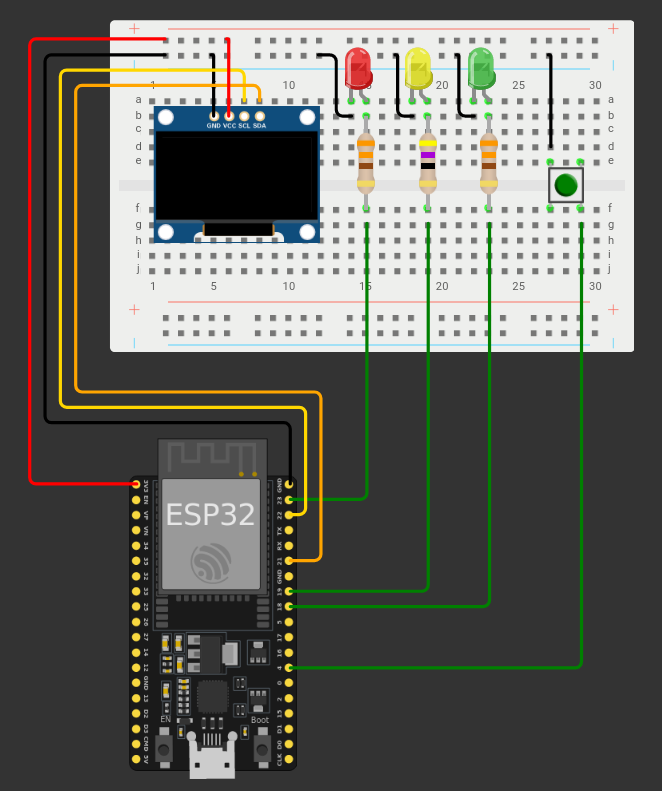
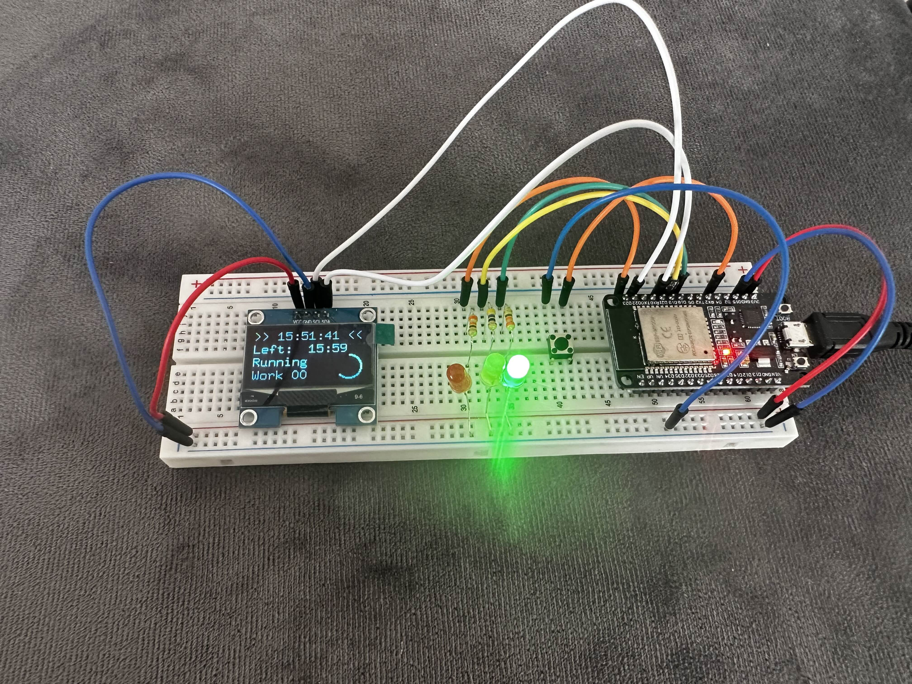

# Pomodoro on ESP32
A simple [Pomodoro](https://en.wikipedia.org/wiki/Pomodoro_Technique) timer made on ESP32 using Rust and esp-idf.

## Features
- Connects to local Wi-Fi and synchronizes clock using SNTP.
- Displays current time.
- Can be configured using environment variables.
- Pressing button pauses the timer.

## Diagram

## In action
